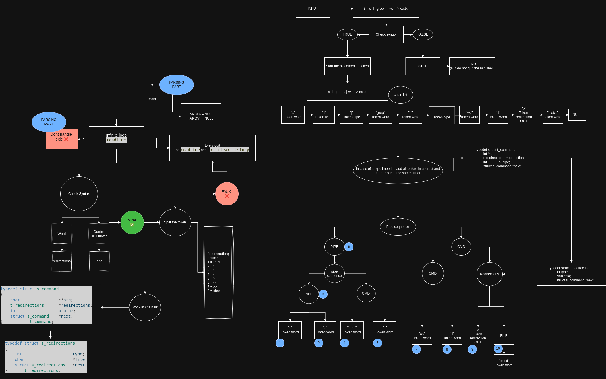
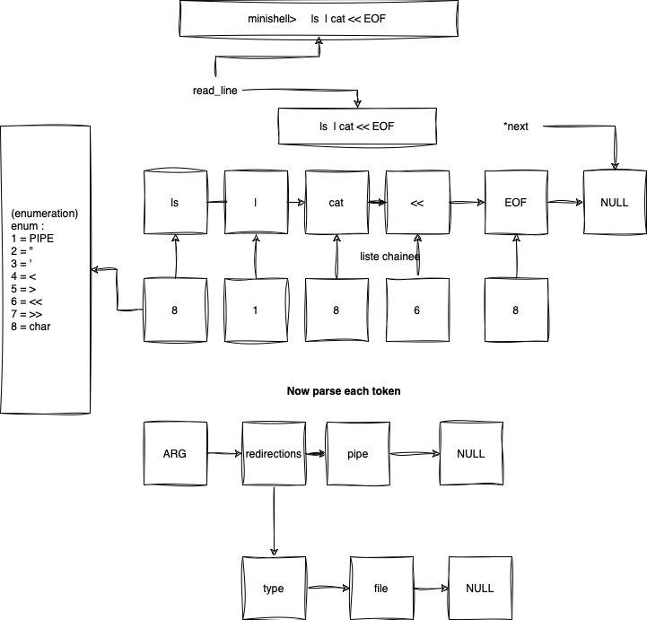

# Mini-Shell 
#  Dpascal--Thobenel 42.nice

Bienvenue sur notre Minishell (Parsing part (for now ... ))

Juste ici on peut trouver un exemple du prompt qu'il faut afficher avant chaque nouvelle commande :

Vous pouvez aussi trouver un pdf qui details le projet, c'etait notre 1er semaine de documentation avant de commencer le projet : 

# schéma parsing part create on (draw.io):

     10/12/2024:
Here some idea we can improve in my parsing :
		Create a handle error system wo track every foncion how use it like
               the handle operator or the pipe handler
          if an error is detected we can print message of every case 
          and of course the message will be the man return error of course 
          we can add emojis or bullshit like that
     
     Make schema for this :
          c4r2p1% echo "hello world" < file.txt | cat file.txt
          zsh: no such file or directory: file.txt
          cat: file.txt: No such file or directory
          c4r2p1% echo "hello world" > file.txt | cat file.txt
          hello world

Updates:

     11/12/2024:
okayy so i now fix the issue with the pipe spend a day on it
also i add the detection of the environement variable so now if you try to print a varibale it now regnosize the word behind i stock in TOKEN_WORD ($VAR == '$' 'VAR')

so now i need to fix another issue with pipe if you do 
ex = 'ls |' it say you have a syntax error and leave the program for now im not sure if i have to quit or not
in bash when you have synntax error it not quit so i just follow the same logic
     
     20/12/2024 :
                                                                           
 ᡕᠵデ气亠 Ak47 ✓

bug encounter or need do be fix like norm error/message

     1) display space instead of error when there is a space or tab
               FIXXXXX (Well done soldier 🪖)

     2) fix there is a double message when the token take a redirections wihout file
               FIXXXXX (Well done soldier 🪖)

     3) multiple message with many pipe
               FIXXXXX (Well done soldier 🪖)

     4) cat Makefile | grep pr | head -n 5 | cd file_not_exist (if the file do not exist, this is the exec part to check this with 'execve')
          issue with some hard input
               FIXXXXX (Well done soldier 🪖)

     06/01/2025 :
For now i finish the token part and handle the syntax 
in mostly every situations
Now i need to add in a struct command if there is a pipe
So for now i re think the split fonction for my token
               FIXXXXX (Well done soldier 🪖)

I need to check for the variable environnements
1) the syntax
2) the name how can accept it
3) Maybe number are allowed and i only accept MAJ 
FIXXXXXX (Well done soldier 🪖)

          ➜  parsing git:(parsing) ✗ echo $A1  

          ➜  parsing git:(parsing) ✗ echo $1A
          A
          ➜  parsing git:(parsing) ✗ 
               (ONLY ON 42 COMPUTER !!!)

               FIXXXXXX (Well done soldier 🪖)
          (the version of the code can act different on the 42 pc and my mac)
          Weird caractere is add to the end of each token ???

     13/01/2025 :
          -add header (norm)
          -handle auxiliaire fonctions (split etc ...)

need to fix :
     $> cat ''hello world''
     Type: TOKEN_WORD, Value: 'cat'
     Type: TOKEN_WORD, Value: ''usermod --shell /bin/bash username 
th the sig.Mask)
     ctrl-\
        ↘️ 
          not work yet

echo "hello world" > file.txt | cat file.txt

leak fix (in way) : 13/01/25 15H                                                  ▄︻デ══━一💥
total heap usage: 483 allocs, 243 frees, 229,053 bytes allocated
LEAK SUMMARY: (wihout the ft_clean_up at the end of main)
     definitely lost: 177 bytes in 9 blocks
     indirectly lost: 66 bytes in 9 blocks
     possibly lost: 0 bytes in 0 blocks
     still reachable: 208,165 bytes in 222 blocks
     suppressed: 0 bytes in 0 blocks
ERROR SUMMARY: 0 errors from 0 contexts (suppressed: 0 from 0)

     HEAP SUMMARY:
     in use at exit: 204,149 bytes in 221 blocks
     total heap usage: 434 allocs, 214 frees, 224,484 bytes allocated

     LEAK SUMMARY: (add the ft_clean_up at the end of main)
     definitely lost: 0 bytes in 0 blocks
     indirectly lost: 0 bytes in 0 blocks
          possibly lost: 0 bytes in 0 blocks
     still reachable: 204,149 bytes in 221 blocks
          suppressed: 0 bytes in 0 blocks
     Rerun with --leak-check=full to see details of leaked memory

     ERROR SUMMARY: 2 errors from 2 contexts (suppressed: 0 from 0)

Updates:

     14/01/2025 :
     - Centraliser la gestion de sortie (free etc ...) 🐴🐴 
     - Debug fonction (need to be repair 🔨🔨)    🔨
     - change message error put the real one      🔨
     - Signal

# Pre-visualalisation des fonctions de debug: 

A activer ou desactiver dans ft_parse_token(const char *input)

ft_split_token(&token, input);

ft_print_command_lst(cmd_lst);

     $> 1 >> 2 > 3 < 4

     Type: TOKEN_WORD, Value: '1'

     Type: TOKEN_APPEND, Value: '>>'

     Type: TOKEN_WORD, Value: '2'

     Type: TOKEN_OUT, Value: '>'

     Type: TOKEN_WORD, Value: '3'

     Type: TOKEN_IN, Value: '<'

     Type: TOKEN_WORD, Value: '4'

     -------------[DEBUG]---------------

     [DEBUG] t_command = pipe: 0

     arg[1]

     [DEBUG] redirections: 

     [DEBUG] redirec file = TOKEN APPEND '>>'

     [DEBUG] filename = 2

     [DEBUG] redirec file = TOKEN_OUT '>'

     [DEBUG] filename = 3

     [DEBUG] redirec file = TOKEN_IN '<'

     [DEBUG] filename = 4

     15/01/2024:

#Gestions des quotes :
Bash parses single- and double-quotes slightly differently. Single-quotes are simpler, so I'll cover them first.

A single-quoted string (or single-quoted section of a string -- I'll get to that) runs from a single-quote to the next single-quote. Anything other than a single-quote (including double-quotes, backslashes, newlines, etc) is just a literal character in the string. But the next single-quote ends the single-quoted section. There is no way to put a single-quote inside a single-quoted string, because the next single-quote will end the single-quoted section.

You can have differently-quoted sections within a single "word" (or string, or whatever you want to call it). So, for example, ''hello'' will be parsed as a zero-length single-quoted section, the unquoted section hello, then another zero-length single-quoted section. Since there's no whitespace between them, they're all treated as part of the same word (and since the single-quoted sections are zero-length, they have no effect at all on the resulting word/string).

Double-quotes are slightly different, in that some characters within them retain their special meanings. For example, $ can introduce variable or command substitution, etc (although the result won't be subject to word-splitting like it would be without the double-quotes). Backslashes also function as escapes inside double-quotes, so \$ will be treated as a literal dollar-sign, not as the start of a variable expansion or anything. Other characters that can have their special meaning removed by backslash-escaping are backslashes themselves, and... double-quotes! You can include a double-quote in a double-quote by escaping it. The double-quoted section ends a the next non-escaped double-quote.

So compare:

     echo ""hello""    # just prints hello
     echo "$PATH"      # prints the value of the PATH variable
     echo ""'$PATH'""  # prints $PATH, because it's in
                    # single-quotes (with zero-lenght)
                    # double-quoted sections on each side

                    
     Also, single- and double-quotes have no special meaning within the other type of quote. So:

     echo "'hello'"    # prints 'hello', because the single-quotes
                    # are just ordinary characters in a
                    # double-quoted string
     echo '"hello"'    # similarly, prints "hello"
     echo "'$PATH'"    # prints the PATH variable with
                    # single-quotes around it (because
                    # $variable expands in double-quotes)
          FIXXXXXX (Well done soldier 🪖)
               
     NOT fix for now

New handle to do :

bash> $$ == PID
bash> $$$ == 'PID'=getpid '$'==carac
bash> $$$$ == PIDPID

     16/01/2025:
alright so i'm done with the handling of the env-var if it is on double quote, but now
i need to refresh the input if another double quote is here

3. declare -p
While this doesn’t directly show the lexical analysis, declare -p can be useful for inspecting how Bash interprets and stores variables. You can see how a variable's content is stored, which might help in understanding how Bash processes input.

#Help full for drawing *https://excalidraw.com/*

Need to be fix :

probleme :
-handle error in ft_handle_quote and ft_check_syntax+
                    

make sure to not broke the parsing 
-quote simple et double badly implement

To fix:
-check que closing quote in ft_check_syntax FIXXXXXX (Well done soldier 🪖)

-make sure for ft_handle_single_quote  FIXXXXXX (Well done soldier 🪖)(i guess need to do more test)

- some case like = ">" or "ls | | wc" need to be fix FIXXXXXX (Well done soldier 🪖)
-in ft_check syntax make sur for every operator is follow by a valid token FIXXXXXX (Well done soldier 🪖)
-handle space around operator FIXXXXXX (Well done soldier 🪖)
-Space problem FIXXXXXX (Well done soldier 🪖)
-redirec wihout file can crash FIXXXXXX (Well done soldier 🪖)
- check for the env var FIXXXXXX (Well done soldier 🪖)

17/01/2025:

- alright i fix the problem with the double quote FIXXXXXX (Well done soldier 🪖)
- handle the env var in double quote FIXXXXXX (Well done soldier 🪖)
- i fix the lexer for the env ver like $$ or $? FIXXXXXX (Well done soldier 🪖)
- if i try 'minishell> echo L$$' it suppose to do 'LPID'
Type: TOKEN_WORD, Value: 'echo'
Type: TOKEN_WORD, Value: 'L$$'

-------------[DEBUG]---------------

[DEBUG] t_command = pipe: 0
[DEBUG] arg = [echo]
[DEBUG] arg = [L$$]
----------------------------------
minishell> ls  | 
 [🚨 ERROR 🚨] pipe = 'syntax error: pipe at the end'
[ERROR] Token invalid ! = ls
Segmentation fault (core dumped)
thobenel@c4r2p2:~/Mini-Shell/parsing$ 

# need to be fix (GLHF) 🪖🪖

⬇️⬇️⬇️

[WELCOME](Minishell.pdf)
